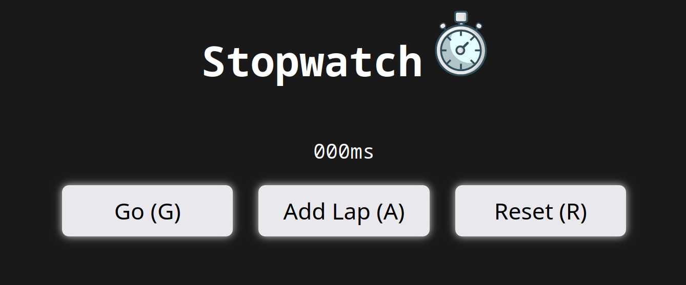
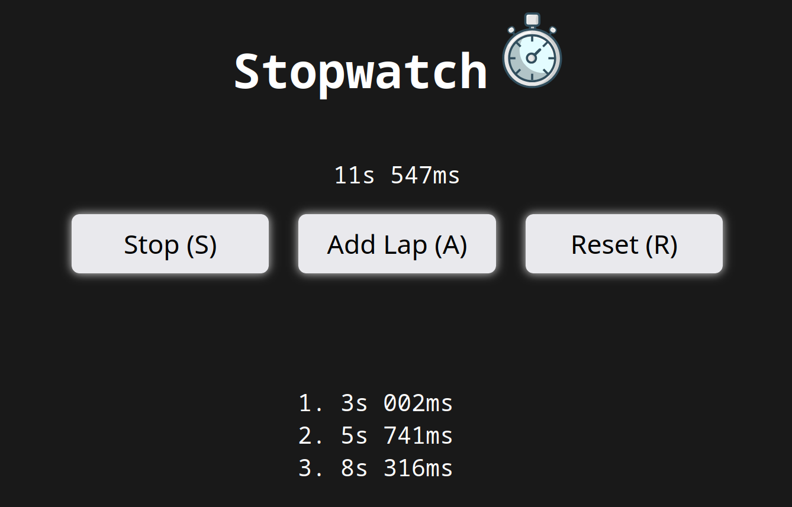
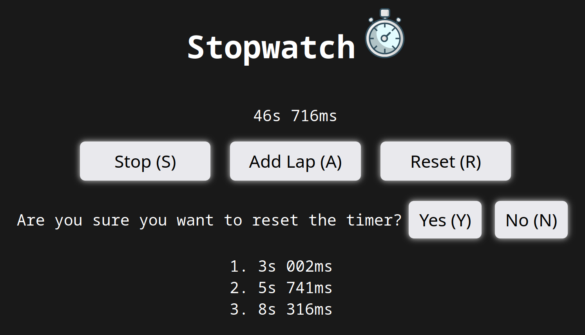

# Stopwatch

> A simple stopwatch project made using HTML, CSS, and JS.

This was part of the [JS course](https://www.youtube.com/watch?v=SBmSRK3feww) by [SuperSimpleDev](https://www.youtube.com/@SuperSimpleDev) that I took to learn JS, HTML, and CSS together.

## Features

- Start/stop button
- Reset button with confirmation message
- The time is stored in the local storage
- Ability to add laps

## Credit

### [Fitness Timer](https://iconduck.com/illustrations/107976/fitness-timer)

By [Lukasz Adam](https://lukaszadam.com/)\
Licensed under [CC0](https://creativecommons.org/publicdomain/zero/1.0/)

## License

© 2023-2025 [Esoteric Enderman](https://enderman.dev)
 
[Stopwatch](./) is licensed under the [AGPL 3.0](./LICENSE) only.

## Topics

[javascript](https://github.com/topics/javascript), [css](https://github.com/topics/css), [html](https://github.com/topics/html), [time](https://github.com/topics/time), [html5](https://github.com/topics/html5), [js](https://github.com/topics/js), [css3](https://github.com/topics/css3), [timer](https://github.com/topics/timer), [stopwatch](https://github.com/topics/stopwatch), [time-tracker](https://github.com/topics/time-tracker), [html-css](https://github.com/topics/html-css), [timers](https://github.com/topics/timers), [html-css-javascript](https://github.com/topics/html-css-javascript), [timer-clock](https://github.com/topics/timer-clock), [timer-application](https://github.com/topics/timer-application), [stop-watch](https://github.com/topics/stop-watch), [timer-counter](https://github.com/topics/timer-counter), [stopwatch-js-app](https://github.com/topics/stopwatch-js-app), [stopwatch-using-javascript](https://github.com/topics/stopwatch-using-javascript), [stop-watch-using-js](https://github.com/topics/stop-watch-using-js)
